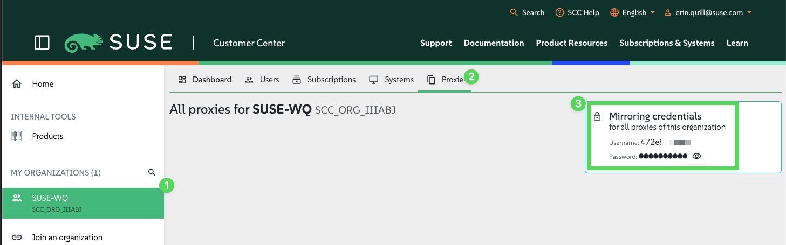
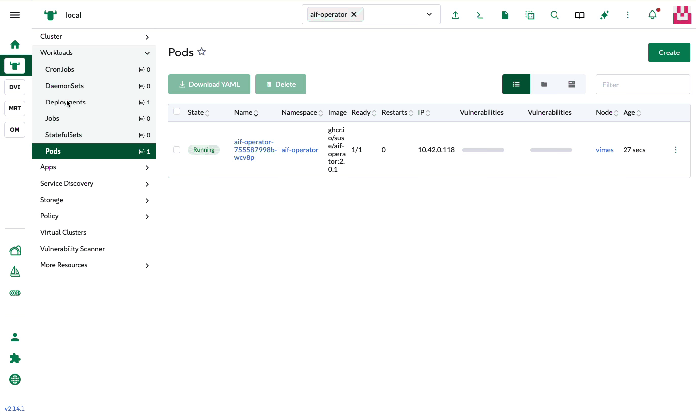

# suse-ai-factory-demos

This repo contains information on how to install and demo **SUSE AI Factory with NVIDIA**.

## Demos

### [Simple Chatbot with RAG](simple-chatbot-rag/README.md)
A very basic RAG system: import a document, then use Open WebUI to ask questions about its content. Runs on CPU.

### [Simple Chatbot with RAG (vLLM and Milvus)](simple-chatbot-rag-vllm-milvus/README.md)
The GPU-accelerated version: vLLM serves the model over an OpenAI-compatible API, with **Milvus** as the RAG vector store.

---

## Install SUSE AI Factory

### Install the operator

From the `local` Rancher cluster, run the following Helm command to install SUSE AI Factory:

You can find the latest version for aif-operator here https://github.com/SUSE/aif

```bash
helm upgrade --install aif-operator \
  oci://ghcr.io/suse/chart/aif-operator:2.0.1 \
  --namespace aif-operator \
  --create-namespace
```

### Create secrets

SUSE AI Factory uses a collection of four secrets to handle authentication.

#### 1. App secret (unique user + unique token)

```bash
kubectl create secret generic appco \
  --namespace=aif-operator \
  --from-literal=username="<your_appco_username_here>" \
  --from-literal=token="<your_appco_token_here>"
```

#### 2. SUSE registry secret (static user + unique token)

```bash
kubectl create secret generic suse-registry \
  --namespace=aif-operator \
  --from-literal=username="<your_proxies_username>" \
  --from-literal=token="<your_proxies_password>"
```




#### 3. NVIDIA secret (static user + unique token)

> **Note:** the single quotes around `$oauthtoken` stop your local shell from treating it as a variable.

```bash
kubectl create secret generic nvidia \
  --namespace=aif-operator \
  --from-literal=username='$oauthtoken' \
  --from-literal=token="<your_nvidia_token_here>"
```


#### 4. Git secret (unique user + unique token)

```bash
kubectl create secret generic git \
  --namespace=aif-operator \
  --from-literal=username="<your_git_username_here>" \
  --from-literal=token="<your_git_token_here>"
```


### Enable the UI plugin

From the Rancher UI, select **UI Plugins** and **Reload** the plugin list. You'll then have access to the SUSE AI
Factory plugin.



### Set up secrets

Now make SUSE AI Factory aware of the secrets it needs when deploying blueprints and applications.

Click each setting to **Test** and verify it, then click **Apply** once all settings pass.

> If you want to store a blueprint deployment in a Git repo, the repo must already exist and contain a
> `/workloads` folder.


