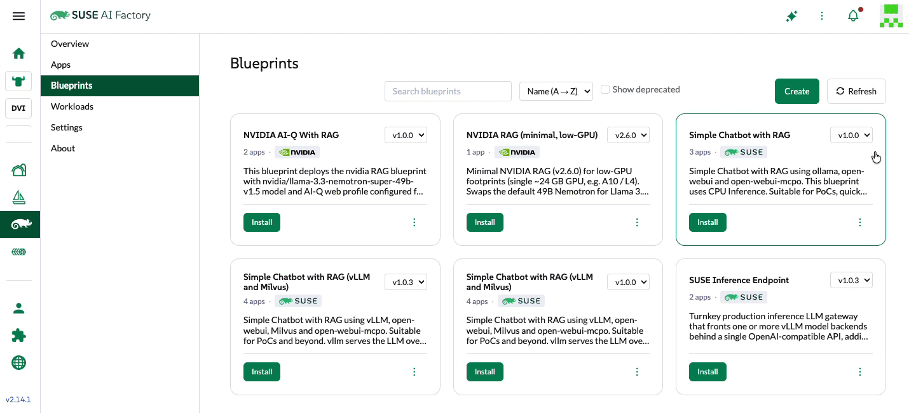

# Simple Chatbot with RAG — Install & Configuration Guide

> **Simple Chatbot with RAG** using `ollama`, `open-webui`, and `open-webui-mcpo`.
> A CPU‑inference blueprint suitable for PoCs and quick explorations. Retrieval‑augmented
> generation uses the **ChromaDB** vector store embedded in open‑webui.

This blueprint is a showcase of how quickly a complete, private RAG chatbot — model serving,
chat UI, document retrieval, and MCP tool calling — can be stood up with **SUSE AI Factory**.
You deploy the blueprint, then adjust a handful of values for your environment.

> **In a hurry?** [QUICKSTART.md](./QUICKSTART.md) is the condensed, K8s‑expert version — the same value
> changes and gotchas, no walkthrough.

---

## The two demos in this blueprint

This blueprint powers **two independent demos** — run either on its own.

| Demo | What the audience sees | Hardware | Minimal Model |
|---|---|---|---|
| **1 — RAG (grounded answers)** | Upload your docs; the bot answers **with citations** and visibly *doesn't* know the same facts without them. | **CPU is fine** | `qwen2.5:3b`  |
| **2 — MCPO memory tool** | The bot **writes to and reads from a persistent knowledge‑graph "memory"** across chats via an MCP tool. | **GPU strongly recommended** | `qwen2.5:7b` |

- **The RAG demo needs nothing from MCPO** — just the web UI reachable and a model. You can skip the
  `TOOL_SERVER_CONNECTIONS` wiring entirely if RAG is all you're showing.
- **The MCPO demo really needs a GPU.** Reliable tool-calling needs a **7B model** (`qwen2.5:7b`); on CPU that's
  too slow to demo. It also needs **Native function calling** turned on (see Demo 2). A 3B model on CPU technically
  works but fumbles the tool calls.

Full walkthroughs: **[Demo 1 — RAG](#demo-1--rag-grounded-answers)** and **[Demo 2 — MCPO memory](#demo-2--mcpo-memory-tool-needs-a-gpu)** below.

---

## Architecture

The blueprint deploys three apps into one namespace (`simple-chatbot-with-rag-system`):

| App | Role |
|---|---|
| `ollama` | Serves the LLM (`gemma:2b`) at `ollama:11434`. |
| `open-webui` | Chat UI + built‑in RAG (ChromaDB + embeddings). Exposed via Ingress. |
| `open-webui-mcpo` | MCP‑to‑OpenAPI proxy exposing MCP tools (the `memory` server) at `open-webui-mcpo:8000`. |

---

## Prerequisites

- **SUSE AI Factory** installed and configured.
- **A default StorageClass** — open‑webui requests a PersistentVolume. Verify:
  ```bash
  kubectl get storageclass          # exactly one should say "(default)"
  ```
- **An ingress controller** — Traefik (RKE2 default) or NGINX. Note its IngressClass name; you set it in the values (`traefik` in the examples).
- **cert-manager** *(required for the HTTPS options; skippable only for the HTTP‑only quick start)*:
  ```bash
  kubectl get pods -n cert-manager  # controller / cainjector / webhook Running
  ```
- **(GPU option only) NVIDIA GPU Operator / device plugin** so the node advertises `nvidia.com/gpu`:
  ```bash
  kubectl get nodes -o jsonpath='{.items[*].status.capacity.nvidia\.com/gpu}{"\n"}'
  ```
- **Resources**: ~6 vCPU / 24 GiB is enough for CPU inference with a small model. Keep to small models
  (`gemma:2b`, `qwen2.5:3b`) — larger CPU models are slow or OOM. With a GPU you can run larger models.

---

## Certificate options at a glance

The chat UI is served over an Ingress. How you terminate TLS is the main decision:

| Option | TLS | Needs | Browser result | Best for |
|---|---|---|---|---|
| **1 - HTTP only** | none | nothing | "Not secure" label, no warning page | fastest demo / air‑gapped PoC |
| **2 - Self‑signed (default)** | cert‑manager self‑signed CA | cert-manager | one‑time "untrusted cert" warning | any cluster with cert‑manager |
| **3 - Let's Encrypt** | real trusted cert | cert-manager + a public DNS zone (e.g. Cloudflare DNS‑01) | green padlock | a real hostname you own |

> The `open-webui` value `global.tls.source` selects the mechanism: `suse-private-ai` (built‑in
> self‑signed via cert‑manager — **the blueprint default**), `secret` (bring‑your‑own / cert‑manager
> issuer / none), or `letsEncrypt`. Each option below tells you what to set.
>
> `global.tls.source` (whether the **chart** provisions cert-manager objects) is a separate knob from
> `ingress.tls` (HTTPS on the Ingress itself). And `ingress.class` must match your controller's IngressClass —
> a typo silently 404s the whole UI.

---

## Editing the blueprint in SUSE AI Factory

Deploy the **Simple Chatbot with RAG** blueprint from the AI Factory catalog. To customize it, open the
blueprint and edit each app's values (`ollama`, `open-webui`, `open-webui-mcpo`) in the values editor,
then re‑deploy/upgrade.



**Everything below is expressed as changes to the shipped default values** — you only touch the keys shown.
Fields not mentioned keep their defaults (the RAG settings `VECTOR_DB: chroma`, the MiniLM embedding model,
`DEFAULT_MODELS: gemma:2b`, signup, persistence, etc. are already set for you).

---

## Two open-webui settings you'll add (same in every option)

Two environment variables go in the **`open-webui`** app's values, inside its **`extraEnvVars`** list — the
same list that already contains `DEFAULT_MODELS`, `VECTOR_DB`, etc. **Append them as new list entries** (don't
replace the existing ones). Unlike the ingress/TLS choice below, **these are identical for all three options**:

- **`INSTALL_NLTK_DATASETS: "false"`** — the default `"true"` re-downloads NLTK data on every restart and can
  hang on GitHub rate-limits (a 429 will 500 the UI). Turn it off.
- **`TOOL_SERVER_CONNECTIONS`** *(Demo 2 / MCPO only — skip it for a RAG-only setup)* — auto-registers the mcpo
  "memory" tool at boot, so no one adds it in the UI. open-webui fetches tool servers **from its backend pod**, so
  this points at the **internal Service** (`open-webui-mcpo:8000`) — same value in every option, **no NodePort or
  mcpo Ingress needed**. Always keep the **`/memory`** suffix — the tool won't load without it.

```yaml
extraEnvVars:                        # append to the existing list — keep the entries already there
  - name: INSTALL_NLTK_DATASETS
    value: "false"
  - name: TOOL_SERVER_CONNECTIONS
    value: '[{"url":"http://open-webui-mcpo:8000/memory","path":"openapi.json","type":"openapi","auth_type":"bearer","headers":null,"key":"","config":{"enable":true,"function_name_filter_list":"","access_control":null},"spec_type":"url","spec":"","info":{"id":"","name":"memory","description":""}}]'
```

> ⚠️ **`TOOL_SERVER_CONNECTIONS` must be a single-line, single-quoted string.** If the values editor pretty-prints
> it into nested YAML, the pod fails to create with `cannot unmarshal array into … EnvVar…value of type string`;
> a `>-` folded block silently injects spaces into the URL (`open-webui-␣␣␣mcpo`). Single quotes are required
> because the JSON uses double quotes.

---

## Optional: Enable the GPU

By default the blueprint runs **CPU inference**. If your cluster has NVIDIA GPUs (via the GPU Operator),
enable GPU in the **`ollama`** values:

```yaml
ollama:
  gpu:
    enabled: true                  # was false
    type: nvidia
    number: 1                      # GPUs to request
    nvidiaResource: nvidia.com/gpu
```

This makes the ollama pod request `nvidia.com/gpu: 1`. Notes:
- Requires the NVIDIA GPU Operator/device plugin (see Prerequisites) so `nvidia.com/gpu` is schedulable.
- If your cluster requires it, also set a runtime class on ollama: `runtimeClassName: nvidia`.
- With a GPU you can move up from `gemma:2b` to a larger model — set `DEFAULT_MODELS` and the ollama
  `models.pull`/`models.run` lists accordingly (e.g. `llama3.1:8b`).

---

## Option 1 — Quickest & easiest (no certs)

No cert‑manager, no cert plumbing. Set `global.tls.source: secret` and serve plain HTTP. Reach the UI **either**
way below — both skip TLS entirely. (The mcpo tool wiring is the internal Service, so there's nothing to do there;
`open-webui-mcpo` stays default in both.)

**1a — Ingress over HTTP** (you want a hostname)
```yaml
# open-webui
global:
  tls:
    source: secret                 # was suse-private-ai — no chart-managed cert
ingress:
  class: traefik                   # was "" — set your IngressClass
  host: suse-ollama-webui.example.local
  tls: false                       # was true — plain HTTP
  annotations: {}                  # drop the nginx ssl-redirect annotation
```
Point a hosts/DNS entry at the ingress node, then browse `http://suse-ollama-webui.example.local`:
```
<NODE_IP>  suse-ollama-webui.example.local
```

**1b — NodePort / LoadBalancer** (no ingress, no hostname, no DNS — the simplest path)
Expose the `open-webui` Service directly. No ingress means no TLS termination, so certs are moot:
```yaml
# open-webui
global:
  tls:
    source: secret                 # no chart-managed cert
ingress:
  enabled: false                   # optional — skip the ingress entirely
service:
  type: NodePort                   # browse http://<node-ip>:30080
  nodePort: 30080
  # …or  type: LoadBalancer        # browse http://<external-ip>/  — needs an LB provider (MetalLB, cloud, k3s/RKE2 svclb)
```

---

## Option 2 — Cluster with cert-manager (blueprint default)

This is closest to the shipped defaults: keep `global.tls.source: suse-private-ai` and cert‑manager mints a
self‑signed cert automatically. HTTPS works with a one‑time "untrusted CA" browser warning. No public DNS needed.

**`open-webui` value changes** — only the host + IngressClass (plus the two `extraEnvVars` above)
```yaml
ingress:
  class: traefik                   # was "" — set your IngressClass
  host: suse-ollama-webui.example.local
  # global.tls.source stays "suse-private-ai" (default) — no change
```
**`open-webui-mcpo`:** no changes.

**Reach it:** a hosts entry pointing at the ingress node, then browse `https://` (accept the cert once):
```
<NODE_IP>  suse-ollama-webui.example.local
```

---

## Option 3 — System like mine (Let's Encrypt already set up)

You have cert‑manager **and** a working ACME `ClusterIssuer` (e.g. `letsencrypt-prod` using **Cloudflare
DNS‑01**) for a domain you control. This yields a real, trusted certificate.

**`open-webui` value changes** (plus the two `extraEnvVars` above)
```yaml
global:
  tls:
    source: secret                 # was suse-private-ai — see note below
ingress:
  class: traefik                   # was ""
  host: suse-ollama-webui.dna-42.com          # your FQDN
  tls: true                        # (default)
  existingSecret: suse-ollama-webui-tls        # was "" — cert-manager fills this
  annotations:
    cert-manager.io/cluster-issuer: letsencrypt-prod   # was the nginx ssl-redirect annotation
```
**`open-webui-mcpo`:** no changes.

> **Why `source: secret`?** With any other value the chart auto‑injects a second `cert-manager.io/issuer`
> annotation alongside your `cluster-issuer` — cert‑manager refuses both and issues nothing. `secret` leaves
> only your annotation, so ingress‑shim issues the real cert into `suse-ollama-webui-tls`.

**DNS:** create an A record for the host pointing at the ingress node IP. If the node IP is private
(e.g. `10.9.0.113`), use **DNS‑only** (grey cloud in Cloudflare) — DNS‑01 validation writes a TXT record
via the API, so the cert issues even though the host resolves to a private address.

**Watch issuance**
```bash
kubectl -n simple-chatbot-with-rag-system get certificate,order,challenge
# READY=True on the certificate → trusted cert served
```

> **DNS‑01 gotcha:** cert‑manager verifies the challenge TXT through its configured recursive resolver.
> If that's `8.8.8.8` and Google is slow/negative‑cached, the challenge can hang for minutes even though the
> record is live on Cloudflare. Since your zone is Cloudflare, point cert‑manager's self‑check at `1.1.1.1`:
> ```
> --dns01-recursive-nameservers-only=true
> --dns01-recursive-nameservers=1.1.1.1:53
> ```

---

## How the MCPO auto‑wiring works (and why the URL matters)

open‑webui loads OpenAPI tool servers **from its backend pod** (not the browser), so:

1. **The internal Service URL is enough** — `http://open-webui-mcpo:8000/memory`. No NodePort, no mcpo Ingress,
   and it's independent of how you expose the UI (HTTP or HTTPS). `open-webui-mcpo` keeps its default ClusterIP.
2. `TOOL_SERVER_CONNECTIONS` **pre‑registers** the tool at boot, so users never add it in the UI. The URL must
   include the **`/memory`** subpath, and the object must include `type: openapi` and `spec_type: url` — the exact
   shape shown above.
3. Keep **`INSTALL_NLTK_DATASETS: "false"`** — the NLTK download otherwise re‑runs on every restart and can hang
   on GitHub rate‑limits.

> Validated on this blueprint's `open-webui` (0.6.x). Older builds ran tool servers **from the browser** and
> required mcpo exposed via a NodePort/Ingress with a scheme matching the page — if you're on an older version,
> expose mcpo and use that browser‑reachable URL instead.

---

## Verify the deployment

```bash
NS=simple-chatbot-with-rag-system
kubectl -n $NS get pods
# ollama, open-webui-0, open-webui-mcpo all Running/Ready

# model present?
kubectl -n $NS exec deploy/ollama -- ollama list      # -> gemma:2b (or qwen2.5:3b)

# mcpo tool spec loads from the backend?
kubectl -n $NS exec open-webui-0 -- \
  curl -s -o /dev/null -w '%{http_code}\n' http://open-webui-mcpo:8000/memory/openapi.json   # -> 200

# UI reachable?
curl -kI https://suse-ollama-webui.<your-domain>/     # -> HTTP 200
```

---

# Demo 1 — RAG (grounded answers)

Runs on **CPU** with the default `gemma:2b`. Needs only the web UI reachable — **no MCPO wiring required**.

### Expose the UI (pick one)
Certs only matter for the Ingress path — see [Certificate options](#certificate-options-at-a-glance).

| Method | `open-webui` value changes | Reach it at |
|---|---|---|
| **Ingress** | `ingress.class: traefik`, `ingress.host: <host>` | `http(s)://<host>` (add a hosts/DNS entry → ingress node) |
| **NodePort** | `ingress.enabled: false`, `service.type: NodePort`, `service.nodePort: 30080` | `http://<node-ip>:30080` |
| **LoadBalancer** | `ingress.enabled: false`, `service.type: LoadBalancer` | `http://<external-ip>/` — needs an LB provider (MetalLB / cloud / RKE2 svclb) |

> **LoadBalancer:** watch the Service until it's assigned an address, then browse the `EXTERNAL-IP`:
> ```bash
> kubectl -n <ns> get svc open-webui -w
> ```

### First-run setup
1. Open the URL. **The first account you create becomes the admin.**
2. Confirm **`qwen2.5:3b`** is selected in the model dropdown.
3. Send "hi" to warm the model up — the first CPU response is the slowest.

### Run the demo
1. **Workspace → Knowledge → Create** a knowledge base named **"Event Horizon"**.
2. Upload the included **[`project_event_horizon_facility.pdf`](./project_event_horizon_facility.pdf)**.
3. Open a new chat, type **`#`** and select **Event Horizon** to attach it.
4. Ask the questions in the table — answers come back **with citations** (click them to show the retrieved text).
5. **The reveal:** ask the same question in a chat **without** the `#` knowledge base — the model doesn't know.
   Same model, one attaches your data, one doesn't. That contrast *is* the demo.

| Ask | Expected grounded answer |
|---|---|
| "When does the Event Horizon Data Center go fully online?" | June 15, 2030 (Phase VI commissioning) |
| "What energizes the core power grid?" | A micro-contained, localized black hole singularity anchored in Sublevel 4 |
| "What's the target noise level in the server rooms?" | Below 5 decibels under full compute load |
| "How much municipal water does the facility use?" | Zero — no additional water |
| "Why is the facility's exterior deep purple?" | A light-absorbent polymer for radiation shielding / thermal-signature obfuscation |

> 🎥 **Video:** _add the RAG demo walkthrough link here._

---

# Demo 2 — MCPO memory tool (needs a GPU)

The memory tool lets the bot **write to and read from a persistent knowledge graph across chats**. This is the
one demo where CPU isn't enough — reliable tool-calling needs a **7B model on a GPU**, so budget for that.

### Requirements
- **GPU enabled** on `ollama` — see [Optional: Enable the GPU](#optional-enable-the-gpu). A 7B model on CPU is too slow to demo live.
- **`qwen2.5:7b`** as the model — `gemma:2b` / `qwen2.5:3b` fumble the tool calls (wrong function, or fake JSON that never fires).
- **`TOOL_SERVER_CONNECTIONS`** wired — see [Two open-webui settings](#two-open-webui-settings-youll-add-same-in-every-option). The `memory` tool then auto-loads; no UI step.
- **Native function calling ON** — the single biggest reliability fix.

### Setup
1. Pull the model and make it the default:
   ```bash
   kubectl -n <ns> exec deploy/ollama -- ollama pull qwen2.5:7b
   ```
   Set `DEFAULT_MODELS=qwen2.5:7b` and add `qwen2.5:7b` to the ollama `models.pull` / `models.run` lists so it survives a redeploy.
2. **Turn on Native function calling:** Admin Panel → Settings → Models → *(your model)* → Advanced Params →
   **Function Calling → `Native`**. The prompt-based "Default" mode makes the model emit fake JSON (a `{}` or a
   JSON blob) that never becomes a real tool call.

### Run the demo
1. New chat → click the **🔧 tools icon** → toggle **memory** on. Keep RAG out of it — **don't `#`-attach a
   knowledge base**, or the retriever muddies the tool answers.
2. **Store** — lead with "**create**" so it calls `create_entities` (not `add_observations` on an entity that
   doesn't exist yet):
   > *"Create a memory entity for me: I'm Erin, I work at SUSE on the AI team, and my favorite database is PostgreSQL. Whenever I’m working on a Linux workstation or server, I’m working on OpenSUSE or SUSE Linux Enterprise Server. Also give me commands the SUSE Operating systems"*
3. **Recall in a brand-new chat** (memory on, nothing attached) — no chat history, yet it still knows. That's the payoff:
   > - *"What do you know about me?"*  → Erin, SUSE, AI team
   > - *"Who leads Project Orion?"*  → Sarah Jenkins (lead), David Vance (co-lead)
   > - *"Who do I report to?"*  → Sarah Jenkins

> **If the store errors** with *"entity not found"* (a `500` on `add_observations`), the model skipped the
> create step — just retry, or re-lead with "**Create** a memory entry…". It's non-deterministic even on 7B.

> 🎥 **Video:** _add the MCPO demo walkthrough link here._

---

## Sample RAG data — `project_event_horizon_facility.pdf`

The repo includes **[`project_event_horizon_facility.pdf`](./project_event_horizon_facility.pdf)** — a fictional
"Project Event Horizon" facility engineering spec (`EH-2030-FACILITY-V11`). It's packed with crisp, unique facts
a base model can't know — a black-hole singularity core power grid, sub-5-decibel server rooms, zero municipal
water, deep-purple radiation shielding, and a 4.2 ms Hawking-venting safety contingency — so grounded retrieval
is obvious and easy to verify. Upload it to the **Event Horizon** knowledge base in the RAG demo above.

---

## Troubleshooting

| Symptom | Cause | Fix |
|---|---|---|
| open-webui pod **fails to create**: `cannot unmarshal array into … EnvVar…value of type string` | `TOOL_SERVER_CONNECTIONS` entered as expanded YAML, not a string | Re-enter it as a **single-line, single-quoted** JSON string. |
| mcpo URL has **spaces** in the hostname (`open-webui-␣␣␣mcpo`) | a `>-` fold / line-wrap injected whitespace | Use the single-quoted one-liner; never fold this value. |
| **404** on the UI host | `ingress.class` ≠ your controller's IngressClass (e.g. `trarfik`) | Set `ingress.class` to your controller's class (`traefik`). |
| UI returns **500 / redirects to `/error`** | `INSTALL_NLTK_DATASETS=true` hit a GitHub 429 and hangs on a download prompt | Set `INSTALL_NLTK_DATASETS: "false"` and restart. |
| **"Failed to connect … OpenAPI tool server"** in the UI | wrong tool URL, or mcpo pod not ready | Use `http://open-webui-mcpo:8000/memory`; confirm the mcpo pod is Running. |
| Tool server added but **no tools appear** | URL missing the `/memory` subpath, so open‑webui loads the empty root spec | Use `…/memory` in the tool URL. |
| Tool **never invoked**, or model prints a JSON blob / `{}` instead of calling it | prompt-based tool mode, or too-small a model | Turn **Function Calling → Native** on the model, and use **`qwen2.5:7b`** (see Demo 2). |
| Memory store fails: **`500` on `add_observations`** / "entity not found" | model called `add_observations` before `create_entities` | Lead the prompt with "**Create** a memory entry…"; retry (non-deterministic). |
| Cert stuck **`Certificate READY=False`**, challenge pending | DNS‑01 self‑check resolver (`8.8.8.8`) not seeing the record | Point cert‑manager at `1.1.1.1` (see Option 3 note). |
| Pods **ImagePullBackOff** from `dp.apps.rancher.io` | No pull secret | Ensure the `application-collection` secret exists in the namespace, or set `global.imagePullSecrets`. |
| GPU model stays on CPU | `nvidia.com/gpu` not schedulable / no runtime class | Confirm the GPU Operator is installed and the node advertises `nvidia.com/gpu`; set `runtimeClassName: nvidia` if required. |
| Browser **cert warning** on Options 1–2 | Expected (HTTP / self‑signed) | Use Option 3 for a trusted cert. |
