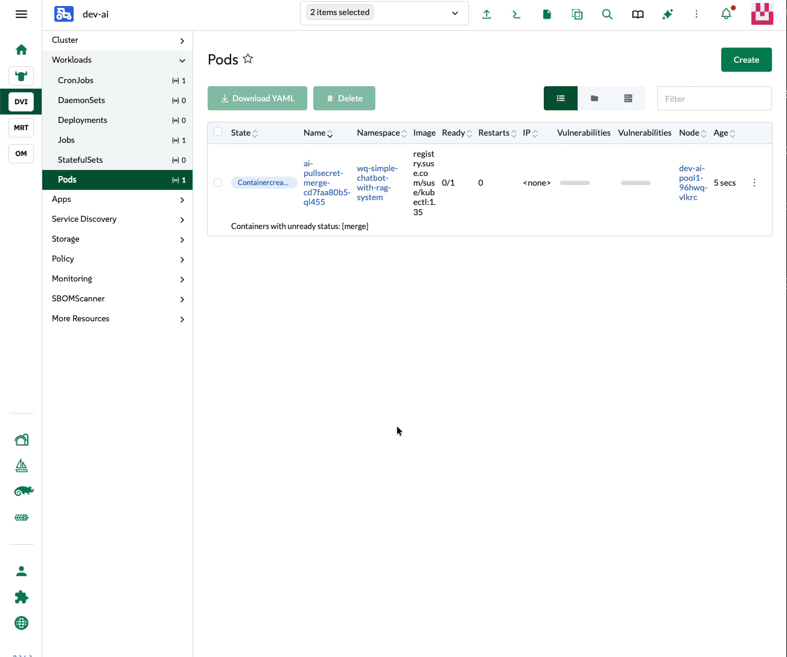

# Simple Chatbot with RAG

`ollama` + `open-webui` + `open-webui-mcpo`, deployed into `simple-chatbot-with-rag-system`. One blueprint,
**two independent demos**.

> ⚡ **In a hurry?** [QUICKSTART.md](./QUICKSTART.md) is the condensed, K8s‑expert version.

## What you can demo
| Demo | What the audience sees | Hardware | Model |
|---|---|---|---|
| **1 — RAG** | Upload a document; the bot answers **with citations** and visibly *doesn't* know the same facts without it. | **CPU is fine** | `qwen2.5:3b` |
| **2 — MCPO memory** | The bot **remembers facts across chats** via an MCP "memory" tool. | **GPU recommended** | `qwen2.5:7b` |

The RAG demo needs only a reachable UI + a model. The memory demo also needs a GPU, a 7B model, and the mcpo tool
wired — all covered below.

---

## Blueprint defaults (out of the box)
Deploy it unchanged and you get:

- **Storage** — `open-webui` claims a **20 Gi** PVC from your cluster's **default StorageClass**.
- **TLS** — cert-manager issues a **self-signed cert** (`global.tls.source: suse-private-ai`) → HTTPS with a one‑time browser warning.
- **Ingress** — enabled, but **`ingress.class` is empty** — you must set it to your controller (`traefik` / `nginx`), or the UI silently **404**s.
- **Model** — `gemma:2b` on **CPU** (fine to boot; weak for real demos).

**You need:** SUSE AI Factory · a default StorageClass · an ingress controller · cert-manager *(for the HTTPS
options)* · **a GPU + the NVIDIA GPU Operator** *(for Demo 2)*.

---

## Customize before you deploy
In AI Factory, **copy the blueprint** and edit each app's values, then deploy. Several settings below are entries
in `open-webui`'s single **`extraEnvVars`** list — **append them all to the one list** (don't replace what's there).


### 1. Model (and GPU)

Here are the minimum models I would try for each demo.

| Demo | Model | ~RAM/VRAM *(approx, Q4 quant)* |
|---|---|---|
| RAG | `qwen2.5:3b` | ~4 GB |
| MCPO memory | `qwen2.5:7b` | ~8 GB (GPU) |

**`ollama`** — pull and run the model:
```yaml
ollama:
  models:
    pull:
      - qwen2.5:3b
    run:
      - qwen2.5:3b
```
**`open-webui`** — make it the dropdown default:
```yaml
extraEnvVars:
  - name: DEFAULT_MODELS
    value: qwen2.5:3b
```
For the 7B model (Demo 2), also enable the GPU in **`ollama`**:
```yaml
ollama:
  gpu:
    enabled: true
    type: nvidia
    number: 1
    nvidiaResource: nvidia.com/gpu
  # runtimeClassName: nvidia   # add if your cluster requires it
```

### 2. Access & certificates
`open-webui` is the only UI you expose. Edit its `global.tls` + `ingress` sections.

**Quickest — no certs (plain HTTP):**
```yaml
global:
  tls:
    source: secret          # required — otherwise the chart still issues a self-signed cert
ingress:
  class: traefik            # your IngressClass (empty by default)
  host: suse-ollama-webui.dev-ai.dna-42.com   # a hostname that resolves to your ingress node
  tls: false
  annotations: {}           # drop the ssl-redirect
```
**Self-signed (blueprint default)** — keep `source: suse-private-ai`; just set class + host:
```yaml
ingress:
  class: traefik
  host: suse-ollama-webui.dev-ai.dna-42.com
```
**Trusted (Let's Encrypt)** — cert-manager + an ACME `ClusterIssuer`:
```yaml
global:
  tls:
    source: secret
ingress:
  class: traefik
  host: suse-ollama-webui.dna-42.com
  tls: true
  existingSecret: suse-ollama-webui-tls
  annotations:
    cert-manager.io/cluster-issuer: letsencrypt-prod
```
> `source: secret` prevents a second `cert-manager.io/issuer` annotation that would make cert-manager refuse to
> issue. For DNS-01 hangs, point cert-manager's self-check at `1.1.1.1` (`--dns01-recursive-nameservers=1.1.1.1:53`).

*No ingress at all?* Set `ingress.enabled: false` and `service.type: NodePort` (`nodePort: 30080`) or
`LoadBalancer` — browse the node/external IP directly, no certs.

### 3. Required for every deploy
**`open-webui`** — turn off the NLTK re-download, or the UI can 500 on a GitHub rate-limit:
```yaml
extraEnvVars:
  - name: INSTALL_NLTK_DATASETS
    value: "false"
```

### 4. Demo 2 only — wire the memory tool
**`open-webui`** — add the mcpo tool server. It points at the **internal Service** (open-webui fetches tool specs
from its backend pod), so no NodePort or mcpo Ingress. **One line, single-quoted:**
```yaml
extraEnvVars:
  - name: TOOL_SERVER_CONNECTIONS
    value: '[{"url":"http://open-webui-mcpo:8000/memory","path":"openapi.json","type":"openapi","auth_type":"bearer","headers":null,"key":"","config":{"enable":true,"function_name_filter_list":"","access_control":null},"spec_type":"url","spec":"","info":{"id":"","name":"memory","description":""}}]'
```
> ⚠️ If the editor expands it into nested YAML the pod fails with `cannot unmarshal array into … EnvVar…value of
> type string`; a `>-` fold injects spaces into the URL. Keep it one line, single-quoted, with the `/memory` suffix.

The model must also **invoke** the tool — use `qwen2.5:7b` and turn on **Native function calling** (Demo 2 below).

---

## Deploy & verify

Deploy the customized blueprint to your target cluster.


Watch it come up in Rancher under **Workloads → Pods**, filtered to the namespace you deployed to.



Open the URL and create the `admin` user (the first account becomes admin).


---

# Demo 1 — RAG (grounded answers)
Runs on **CPU** with `qwen2.5:3b`. Needs only a reachable web UI — **no MCPO wiring**.

**First-run:** open the URL → the **first account you create becomes admin** → confirm `qwen2.5:3b` is selected →
send "hi" to warm up (the first CPU response is the slowest).

**Ask without RAG first (baseline):** the model *doesn't* know the document's facts — that's the "before" shot.


**Run it:**
1. **Workspace → Knowledge → Create** a knowledge base named **"Event Horizon"**.
2. Upload the included **[`project_event_horizon_facility.pdf`](./project_event_horizon_facility.pdf)**.


3. New chat → type **`#`** → select **Event Horizon** to attach it.
4. Ask the questions below — answers come back **with citations** (click to show the retrieved text).
5. **The reveal:** ask the same question in a chat **without** the `#` knowledge base — the model doesn't know.
   Same model, one attaches your data, one doesn't. That contrast *is* the demo.


| Ask | Expected grounded answer |
|---|---|
| "When does the Event Horizon Data Center go fully online?" | June 15, 2030 (Phase VI commissioning) |
| "What energizes the core power grid?" | A micro-contained, localized black hole singularity anchored in Sublevel 4 |
| "What's the target noise level in the server rooms?" | Below 5 decibels under full compute load |
| "How much municipal water does the facility use?" | Zero — no additional water |
| "Why is the facility's exterior deep purple?" | A light-absorbent polymer for radiation shielding / thermal-signature obfuscation |

> 🎥 **Video:** _add the RAG demo walkthrough link here._

---

# Demo 2 — MCPO memory tool (needs a GPU)
The memory tool gives the bot a **persistent knowledge graph** it writes to and reads from **across chats**. The
payoff: teach it something in one chat, then in a **brand-new chat with no history** it still knows — and *applies*
it. We'll teach it that you run **SUSE Linux**, then watch it hand back **`zypper`** commands in a fresh chat.

> **How the memory tool actually behaves:** it's *recall-on-request*, not always-on context. The model only uses a
> stored fact if it **calls the memory tool** on that turn. So the demo (1) turns on the tool, (2) uses a system
> prompt telling the model to consult memory, and (3) leans on phrasing that invokes it. Storing a fact alone won't
> silently change answers.

### Setup (once)
1. **GPU + `qwen2.5:7b`** and the **mcpo tool wired** — see **[Model + GPU](#1-model-and-gpu)** and
   **[wire the tool](#4-demo-2-only--wire-the-memory-tool)**.
2. **Native function calling ON:** Admin Panel → Settings → Models → `qwen2.5:7b` → Advanced Params →
   **Function Calling → `Native`**. (The "Default" prompt mode emits fake JSON that never fires — this is the single
   biggest reliability fix.)
3. **Give the model a memory system prompt** (Admin → Settings → Models → `qwen2.5:7b` → **System Prompt**) so it
   actually consults its memory:
   > *You have a persistent memory tool. Before answering questions about the user or giving shell/Linux commands,
   > call `read_graph` to load the user's stored preferences and apply them. When the user tells you something to
   > remember, store it with `create_entities` and always include an `entityType`.*

### Act 1 — Teach it (chat A)
New chat → click the **🔧 tools icon** → toggle **memory** on (keep RAG **off** — don't `#`-attach a knowledge
base). Then:
> *"Remember this about me as a preference: I run SUSE Linux (openSUSE / SLES), so always give me `zypper`
> commands, never apt or yum."*

It calls `create_entities` and saves the preference.

### Act 2 — Prove it persists (brand-new chat)
Open a **new chat** — no history, memory still on — and ask:
> *"What do you know about my setup?"*

It calls `read_graph` and recalls that you run SUSE. Different chat, zero context — it still knows.

### Act 3 — The payoff (same new chat)
> *"Based on what you know about my system, how do I install and update nginx?"*

It returns **`zypper install nginx`** / **`zypper up`** — not `apt` — because it pulled your distro from memory,
not from anything you said in *this* chat. That "it just knows my environment" moment is the demo. *(With the
system prompt set, even a plain "how do I install nginx?" will pull from memory.)*

> **Troubleshooting the store:** if it errors with a **422 / "issue with the JSON input format"**, the model
> omitted the required **`entityType`** — just retry, or say *"store it as a preference named `linux` of type
> `preference`"*. It's non-deterministic even on 7B. If it answers with `apt` anyway, it skipped the memory lookup
> — re-ask *"based on what you remember about my OS, redo that."*

> 🎥 **Video:** _add the MCPO demo walkthrough link here._

---

## Sample RAG data — `project_event_horizon_facility.pdf`
The repo includes **[`project_event_horizon_facility.pdf`](./project_event_horizon_facility.pdf)** — a fictional
"Project Event Horizon" facility engineering spec (`EH-2030-FACILITY-V11`) full of crisp, unique facts a base
model can't know (black-hole core power, sub-5-decibel rooms, zero municipal water, deep-purple shielding, a
4.2 ms Hawking-venting contingency), so grounded retrieval is obvious and easy to verify.

---

## Troubleshooting
| Symptom | Cause | Fix |
|---|---|---|
| open-webui pod **fails to create**: `cannot unmarshal array into … EnvVar…value of type string` | `TOOL_SERVER_CONNECTIONS` entered as expanded YAML | Re-enter as a **single-line, single-quoted** string. |
| mcpo URL has **spaces** (`open-webui-␣␣␣mcpo`) | a `>-` fold / line-wrap | never fold this value |
| **404** on the UI host | `ingress.class` ≠ your controller's IngressClass (e.g. `trarfik`) | set `ingress.class` to `traefik` (or your class) |
| **can't reach the UI / no Service created** | `service.type` misspelled (e.g. `Nodeport`) | it's case-sensitive — use exactly `NodePort` / `LoadBalancer` / `ClusterIP` |
| UI **500 / redirects to `/error`** | `INSTALL_NLTK_DATASETS=true` hit a GitHub 429 | set `"false"`, restart |
| **"Failed to connect … OpenAPI tool server"** | wrong tool URL, or mcpo not ready | use `http://open-webui-mcpo:8000/memory`; check the mcpo pod |
| Tool added but **no tools appear** | missing `/memory` subpath | use `…/memory` |
| Tool **never invoked** / model prints `{}` or a JSON blob | prompt-based tool mode, or too-small a model | Function Calling → **Native**, and use **`qwen2.5:7b`** |
| Memory store fails: **`500` on `add_observations`** | model skipped `create_entities` | lead with "**Create** a memory entry…"; retry |
| Cert stuck **`READY=False`**, challenge pending | DNS-01 self-check on `8.8.8.8` | point cert-manager at `1.1.1.1` |
| **ImagePullBackOff** from `dp.apps.rancher.io` | no pull secret | ensure the `application-collection` secret / `global.imagePullSecrets` |
| GPU model runs on **CPU** | `nvidia.com/gpu` not schedulable | GPU Operator + `runtimeClassName: nvidia` |
